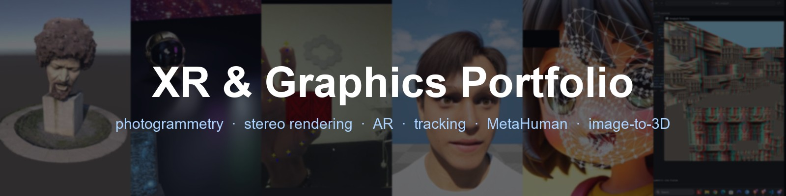
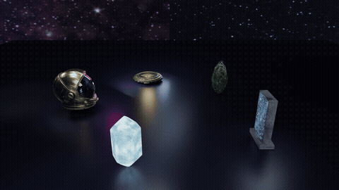
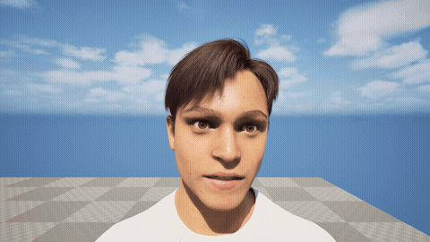
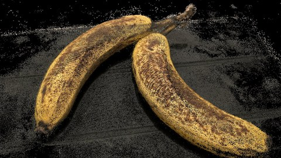
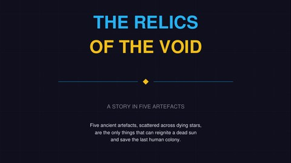
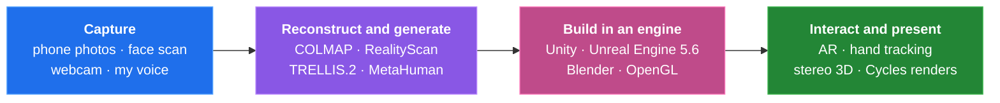
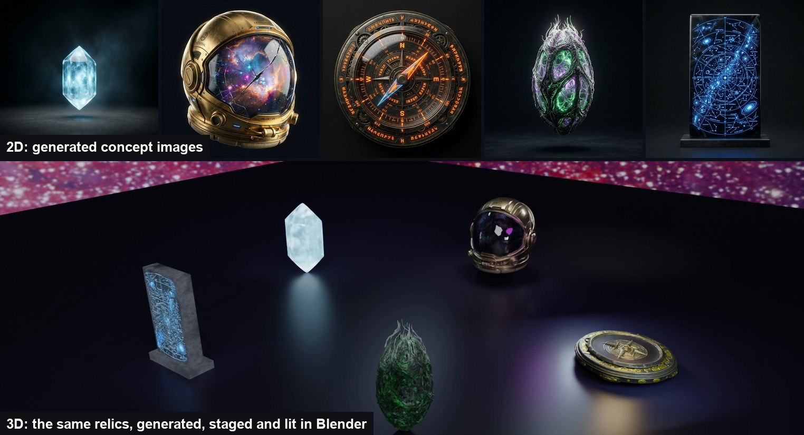

  

  <b>Take something from the real world, get it into an engine, and make it look and behave right.</b> 
  Kartik Gupta · Trinity College Dublin, M.A.I. Computer Engineering · Extended Reality, spring 2026 (85, Distinction)

---

## The Projects

<table>
<tr>
<td width="33%" align="center"> <b>Dublin Landmark Scan</b> 150 photos to a 142k-triangle model, in Unity and AR</td>
<td width="33%" align="center"> <b>Image to 3D in Blender</b> 5 generated props, 17 lights, Cycles</td>
<td width="33%" align="center"> <b>AR Hand Tracking</b> pinch, carry and throw in 3D, 18 to 30 FPS</td>
</tr>
<tr>
<td align="center"> <b>MetaHuman Digital Double</b> my face scan, rigged in Unreal Engine 5.6</td>
<td align="center"> <b>Face Mesh Tracking</b> human, cartoon, emoji and animal faces</td>
<td align="center"> <b>Anaglyph Stereo Rendering</b> toe-in vs off-axis cameras, C++/OpenGL</td>
</tr>
<tr>
<td align="center"> <b>Photogrammetry with COLMAP</b> 64/64 photos registered, 1.96M-triangle mesh</td>
<td align="center"> <b>AI Story Booklet</b> 5 generated images built to become 3D</td>
<td align="center"> <b>Image-Target AR in Unity</b> tracking tested against size and light</td>
</tr>
</table>

---

## How They Fit Together

## From 2D Concept to 3D Scene

  

I designed the [story booklet's](ai-story-booklet) images to be clean inputs for image-to-3D, then [generated, staged and lit](image-to-3d-blender) the same five relics in Blender.

---

## Contents

| Project | What I built | Tools |
|---|---|---|
| [Dublin Landmark Scan](dublin-landmark-scan) | A sculpture scanned from 150 photos, cleaned from a 26M-triangle scan to a 142k-triangle model, shown with an orbit camera and in AR | RealityScan, Blender, Unity, Vuforia, C# |
| [Image to 3D in Blender](image-to-3d-blender) | Five generated relics normalised, staged on a ring, lit with 17 lights and rendered as a 240-frame orbit | TRELLIS.2, Blender 5, Cycles |
| [AR Hand Tracking](ar-hand-tracking) | Two-hand tracking that lets you pinch, carry and throw a virtual cube in 3D | Python, MediaPipe, OpenCV, OpenGL |
| [MetaHuman Digital Double](metahuman-digital-double) | A rigged MetaHuman built from a scan of my face, animated from my own voice | Unreal Engine 5.6, MetaHuman Animator |
| [Face Mesh Tracking](face-mesh-tracking) | Face-mesh tracking over video, stress-tested on human, cartoon, emoji and animal faces | Python, MediaPipe, OpenCV |
| [Anaglyph Stereo Rendering](stereo-anaglyph-rendering) | Toe-in and off-axis stereo cameras, two-pass red-cyan rendering and a 100-object depth scene | C++, OpenGL, GLM |
| [Photogrammetry with COLMAP](photogrammetry-colmap) | A 64-photo object scan: every image registered at 1.29 px error, a 447k-point dense cloud, a 1.96M-triangle mesh | COLMAP |
| [AI Story Booklet](ai-story-booklet) | A five-page illustrated story with prompts designed to feed image-to-3D | Gemini (Nano Banana Pro) |
| [Image-Target AR in Unity](unity-image-target-ar) | A first image-target AR scene, with tests of target size and lighting on tracking | Unity, Vuforia |

---

## Related

- **[ARIA](https://github.com/XxAG17xX/ARIA)**: voice to generative 3D in mixed reality on a Meta Quest 3, the final project of the same module ([demo video](https://www.youtube.com/watch?v=2N-jfHEKipg)).
- **[VR Lunar South Pole](https://github.com/XxAG17xX/VR-LunarSouthPole)**: my final-year project, a walkable lunar south pole from NASA elevation data on a standalone headset ([walkthrough](https://youtu.be/z2SDj-kG6RA)).

---

<b>Notes on what is and isn't here</b>

- Each project folder summarises what was asked; where work started from a provided template, the folder says which parts are mine.
- Large raw data (the 26M-triangle dense mesh, full-resolution photo sets, COLMAP databases) is left out; the folders keep the final outputs and a sample of the inputs.
- Licence keys and other private settings were removed before publishing.

