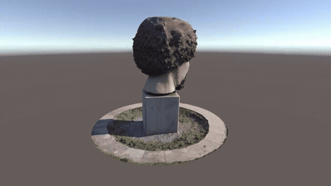
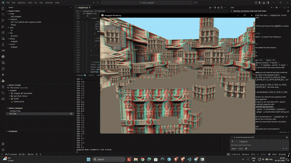

# Extended Reality Coursework

> Stereo rendering, photogrammetry, AR, face and hand tracking, MetaHuman and AI-generated 3D, built across one semester

**Author:** Kartik Gupta | **Trinity College Dublin**, M.A.I. Computer Engineering | **Extended Reality module, spring 2026 (85, Distinction)**

---

## What This Is

Every lab and assignment from my Extended Reality module, each in its own folder with the code, the outputs, a demo video and a short write-up of what I built and what came out of it. The final project, **ARIA**, lives in [its own repository](https://github.com/XxAG17xX/ARIA).

The thread through all of it: take something from the real world (a sculpture, a face, a hand, a room), get it into an engine, and make it look and behave right.

---

## Highlights

<table>
<tr>
<td width="50%" align="center"> <b>Photogrammetry to Unity</b> 150 photos to a 142k-triangle model, with AR</td>
<td width="50%" align="center"> <b>Image to 3D in Blender</b> 5 generated props, 17 lights, Cycles render</td>
</tr>
<tr>
<td align="center"> <b>AR Hand Tracking</b> grab and throw a virtual cube, 18 to 30 FPS</td>
<td align="center"> <b>MetaHuman in Unreal Engine 5.6</b> my face scan, rigged and voice-animated</td>
</tr>
<tr>
<td align="center"> <b>Anaglyph Stereo Rendering</b> toe-in and off-axis cameras in C++/OpenGL</td>
<td align="center"> <b>Vuforia AR</b> the scanned sculpture placed on a real desk</td>
</tr>
</table>

---

## Contents

| Folder | What I built | Tools |
|---|---|---|
| [lab2-anaglyph-stereo](lab2-anaglyph-stereo) | Toe-in and off-axis stereo cameras with two-pass red-cyan rendering, a live eye-separation control and a 100-object depth test scene | C++, OpenGL, GLM |
| [lab4-unity-ar](lab4-unity-ar) | First image-target AR scene, with tests of target size and lighting on tracking | Unity, Vuforia |
| [lab5-photogrammetry](lab5-photogrammetry) | 64-photo object scan: all images registered at 1.29 px error, a 447k-point dense cloud and a 1.96M-triangle mesh | COLMAP |
| [lab6-face-landmarks](lab6-face-landmarks) | Face-mesh tracking over video files, stress-tested on human, cartoon, emoji and animal faces | Python, MediaPipe, OpenCV |
| [lab7-metahuman](lab7-metahuman) | A rigged MetaHuman built from a scan of my face, animated from my own voice | Unreal Engine 5.6, MetaHuman Animator |
| [lab8-image-generation](lab8-image-generation) | A 5-page illustrated story booklet, with prompts designed to feed image-to-3D | Gemini (Nano Banana Pro) |
| [lab9-image-to-3d](lab9-image-to-3d) | The booklet's 5 relics turned into 3D, staged, lit and rendered as a 240-frame orbit | TRELLIS.2, Blender 5, Cycles |
| [assignment1-virtual-field-trip](assignment1-virtual-field-trip) | A Dublin sculpture scanned from 150 photos, cleaned to 142k triangles, shown with an orbit camera and in AR | RealityScan, Blender, Unity, Vuforia, C# |
| [assignment2-hand-tracking](assignment2-hand-tracking) | Two-hand tracking that lets you pinch, carry and throw a virtual cube in 3D | Python, MediaPipe, OpenCV, OpenGL |
| [ARIA](https://github.com/XxAG17xX/ARIA) (final project) | Speak a request and a generated 3D object appears in your real room on a Meta Quest 3 | Unity 6, C#, Claude, Gemini, Tripo3D |

---

## Related

- **[ARIA](https://github.com/XxAG17xX/ARIA)**: the module's final project, voice to generative 3D in mixed reality ([demo video](https://www.youtube.com/watch?v=2N-jfHEKipg)).
- **[VR Lunar South Pole](https://github.com/XxAG17xX/VR-LunarSouthPole)**: my final-year project, a walkable lunar south pole from NASA elevation data on a standalone headset ([walkthrough](https://youtu.be/z2SDj-kG6RA)).

---

## Notes

- Lecturer briefs are not included; each folder summarises what was asked. Where a lab started from a provided template, the folder says which parts are mine.
- Large raw data (the 26M-triangle dense mesh, full-resolution photo sets, COLMAP databases) is left out; the folders keep the final outputs and a sample of inputs.
- Personal details (a student ID used as an AR target, licence keys, my face in one recording) were removed or blurred before publishing.
