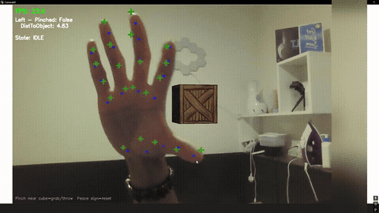

# AR Hand Tracking

> Pinch a virtual cube with your real hand, carry it in 3D and throw it

**Demo:** [demo.mp4](demo.mp4) (8 min, narrated: demo first, then how it works)

## What was asked
Using a provided template, track hands with **MediaPipe**, recover their 3D pose with **OpenCV solvePnP**, render the webcam feed and a cube in **OpenGL**, and let a pinch grab and move the cube, in real time with both hands and depth.

## What I did
- **Tracking and pose:** both hands, 21 joints each, aligned to the camera with a two-stage solvePnP plus smoothing.
- **Rendering:** the live feed drawn in OpenGL, with the 3D projection built from the same camera settings used for tracking so the 3D markers land on the real hand.
- **Interaction:** pinch to grab within 10 cm, carry in x, y and z, release to throw with momentum and drag, peace sign to reset.

## Problems I hit and fixed
| Problem | Fix |
|---|---|
| The pinch flickered on and off, dropping the cube | Hysteresis (grab at 3.5 cm, release at 4.9 cm) plus smoothing |
| A closed fist grabbed everything it touched | Only a fresh pinch, started near the cube, can grab |
| Thrown cubes left the screen | Bounds that widen with depth (half-width = depth x tan(FOV / 2), source credited in the code) |

## Results
- Runs at **18 to 30 FPS** on a laptop CPU (on-screen counter).

## Files
- `prediction.py` (tracking and pose), `gl.py` (rendering and interaction): my parts of the template. `demo.mp4`: the right edge is blurred to keep my face out, as the brief asked.

<b>What I would change</b>

Make the physics independent of frame rate, draw the cube behind the hand when the hand is in front, and fix a few HUD colours that render blue instead of red.

