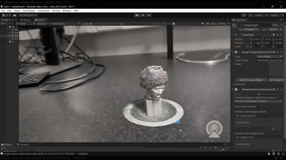
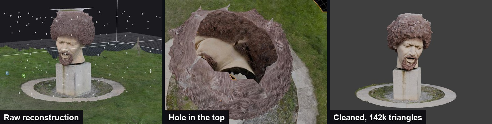

# Dublin Landmark Scan

> A Dublin landmark scanned from my phone, cleaned into a game-ready model, and shown in Unity and in AR

**Demo:** [demo.mp4](demo.mp4) | **Model on Sketchfab:** [skfb.ly/pGUDx](https://skfb.ly/pGUDx)

## What was asked
Recreate a Dublin landmark as a clean 3D model, fly a camera around it in Unity, place it in a real scene with AR, and publish it on Sketchfab.

## What I did

1. **Capture:** photographed the Luke Kelly sculpture in **150** photos over two sessions; the second was a re-shoot to cover the top of the head.
2. **Reconstruction:** built it in **RealityScan**: **572,707** sparse points and a **26.2 million**-triangle dense mesh.
3. **Cleanup:** cropped, removed broken vertices on the top of the head, closed the hole and decimated in **Blender**: a 3.15M-triangle mesh for Unity and a **141,896**-triangle final model with an 8K texture.
4. **Unity:** a C# orbit camera on a pivot for the fly-around, with the lighting retuned for the model.
5. **AR:** the model anchored on an image target with **Vuforia**, extended from my [image-target AR project](../unity-image-target-ar) project.

## Files
- `model/`: the final 142k-triangle OBJ with 4K diffuse and normal maps. `capture/`: sample photos. `report.pdf`: my report.
- `unity-orbit-camera/`, `unity-vuforia-ar/`: scenes, scripts and settings. The 355 MB Unity mesh is not included (use the model above or Sketchfab), the Vuforia package restores from Unity's Package Manager, and the AR image target was a personal ID card, so it is removed; use any image of your own.
- `analysis/`: my later review of the texture.

<b>What I would change</b>

Looking back at my own asset: the final mesh uses only **7.9%** of its 8K texture because I unwrapped before cropping, Unity capped the maps at 2048, the normal map was imported as a colour texture, the green patch on the head comes from the hole-fill polygon stretching across grass texture, and a duplicated orbit script doubled the camera speed. Re-unwrapping and re-baking after the crop would fix the first and fourth.

