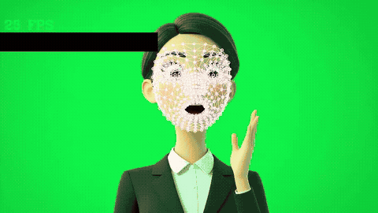

# Face Mesh Tracking

> A dense face mesh tracked through video, and a look at where it breaks

**Demo:** [demo.mp4](demo.mp4) (2 min, all nine test clips)

## What was asked
Extend a webcam face-mesh script (**MediaPipe Face Mesh**) to (a) handle multiple faces, (b) read a video file, (c) write the annotated video, then test it on human faces of different ages and on cartoon faces.

## What I did
- Added video-file input and annotated video output, and fixed the template's missing BGR to RGB conversion.
- Batch-processed **9** public clips into one review video; all **3,974** input frames were written out.
- Went past the brief's test set with an emoji and a gorilla alongside people of several ages and stylised 3D cartoons.

## Results
| Input | Frames with a face mesh |
|---|---|
| Human faces | 100% |
| Gorilla | 82% |
| Emoji | 69% |
| Large-eyed 3D cartoon | 99.8%, but badly fitted |

The interesting failure is the last one: the model reports a face but forces a human face shape onto it, so the mesh lands in the wrong place without any error.

## Files
- `capture.py`: my script. `demo.mp4`: the annotated output for all nine public test clips.

<b>What I would change</b>

Write each clip at its own frame rate instead of a fixed 30 fps, drop the webcam mirror flip for files, and actually test the multi-face setting (every test clip had one face).

