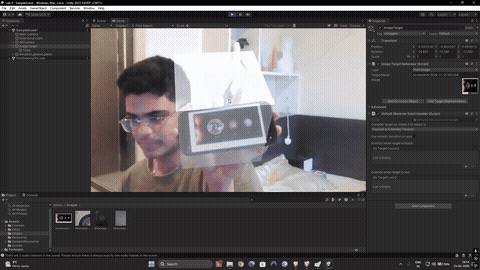

# Lab 4: Image-Target AR in Unity

> A first augmented reality scene: a virtual object locked to a printed image, seen through a webcam

**Demo:** [demo.mp4](demo.mp4) (2.5 min, narrated)

## What was asked
Set up **Vuforia Engine** in Unity with an AR camera in webcam play mode, create an **image target**, attach a virtual object to it, and record the result.

## What I did
- Built the scene with **Vuforia Engine 11.4.4**: an image target made from a space poster, with the brief's semi-transparent cube attached.
- Tested what makes tracking hold or fail. I compared the target's physical width setting at 0.5 against the default 0.2 and explained the choice (a large image, a small cube, a weak laptop webcam), then showed tracking recovering once I added more light.

## Notes
- The virtual object is the brief's own cube; this Unity project became the starting point for the AR half of [Assignment 1](../assignment1-virtual-field-trip), where the cube is replaced by my scanned sculpture.
