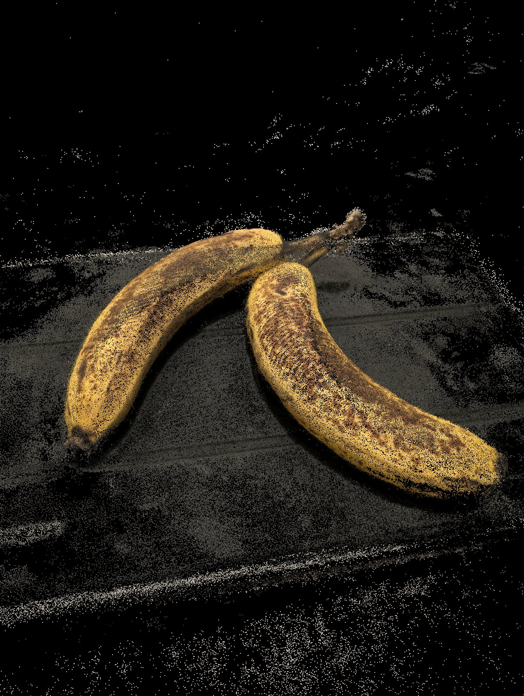
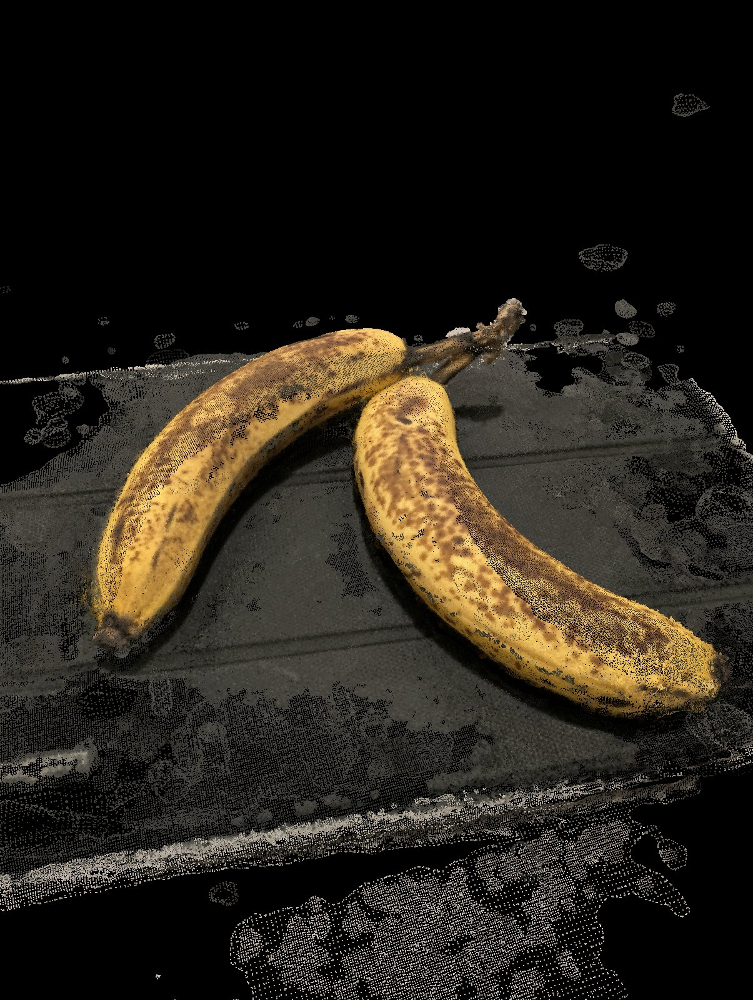

# Lab 5: 3D Scanning with COLMAP

> From 64 phone photos to a dense point cloud and a meshed object

## What was asked
Scan an object of your choice with **COLMAP**: structure from motion for a sparse model, multi-view stereo for a dense cloud, then a mesh.

## What I did
- Shot **64** photos on a Pixel 9 Pro XL (50 MP) in three orbits at different heights around the subject.
- Reconstructed in COLMAP (Medium quality preset).

## Results
| Stage | Result |
|---|---|
| Registration | **64 / 64** images |
| Sparse model | **14,749** points, **1.29 px** mean reprojection error |
| Dense cloud | **446,940** points |
| Poisson mesh | **1,956,633** triangles |

## Files
- `capture/`: 6 sample photos (downsized). `sparse_points.ply`: the sparse model. `renders/`: views of the dense cloud and mesh.

## What I would change
Brighter, even light with faster shutter speeds, a textured mat under the object, one lens throughout, then crop and clean the mesh.
