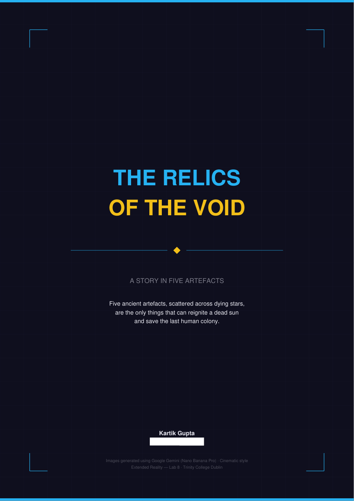
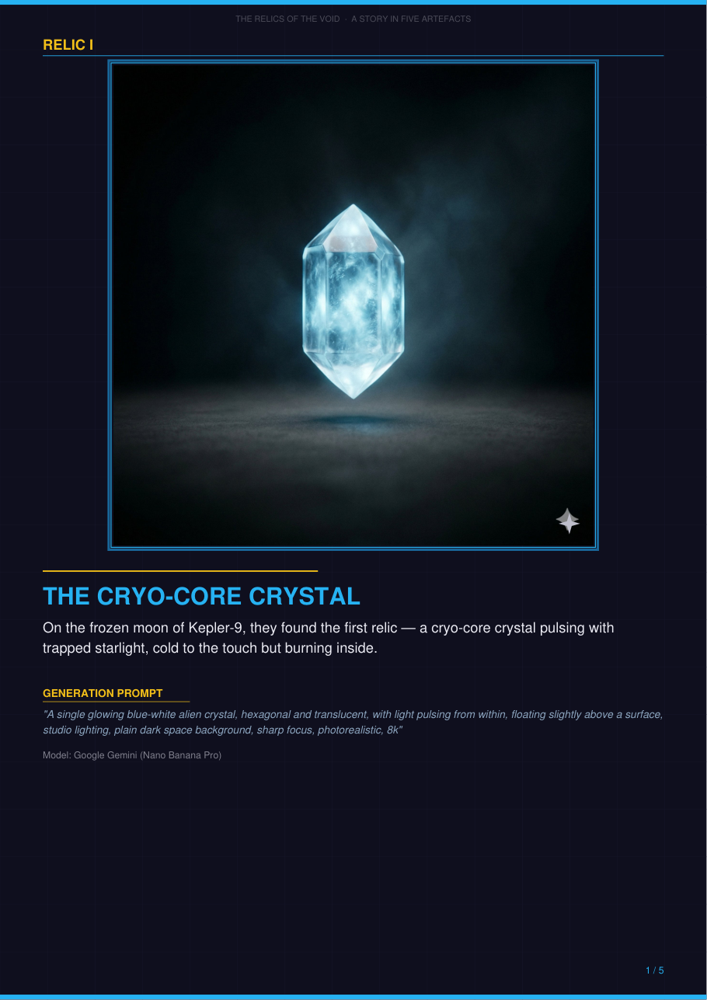
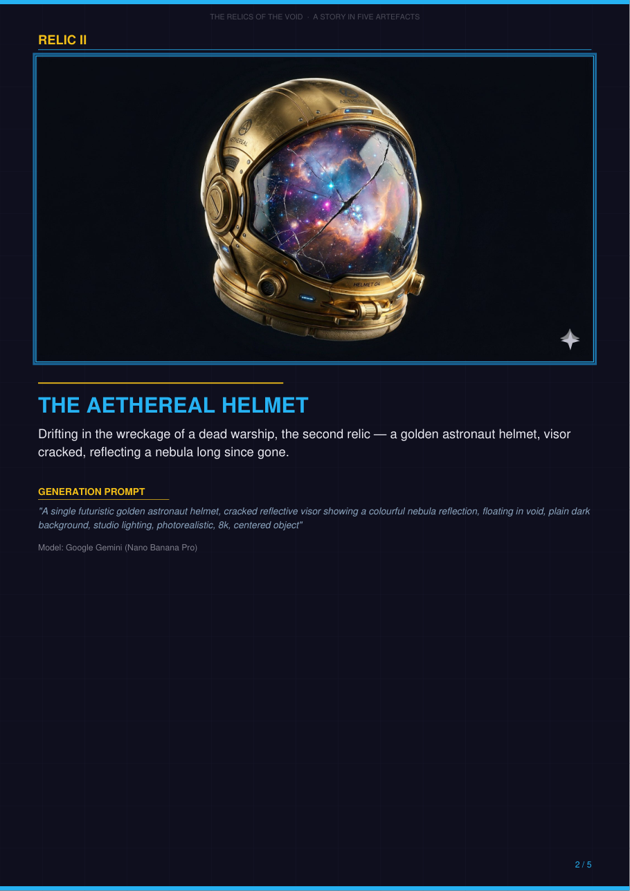

# Lab 8: AI Image Generation, The Relics of the Void

> A five-page illustrated story, with every image designed to become a 3D asset in the next lab

## What was asked
Explore image-generation models and make a five-page digital booklet that tells a story, one generated image and caption per page.

## What I did
- Wrote a short story about five relics that could save the last human colony, and generated the five images with **Google Gemini (Nano Banana Pro)**.
- Used one prompt template for all five: a single centred object, plain dark background, studio lighting. That keeps each image clean enough for an image-to-3D model, which is what [Lab 9](../lab9-image-to-3d) needed.

## Files
- `relics_of_the_void_booklet.pdf`: the booklet. `booklet_page_*.png`: page previews.
