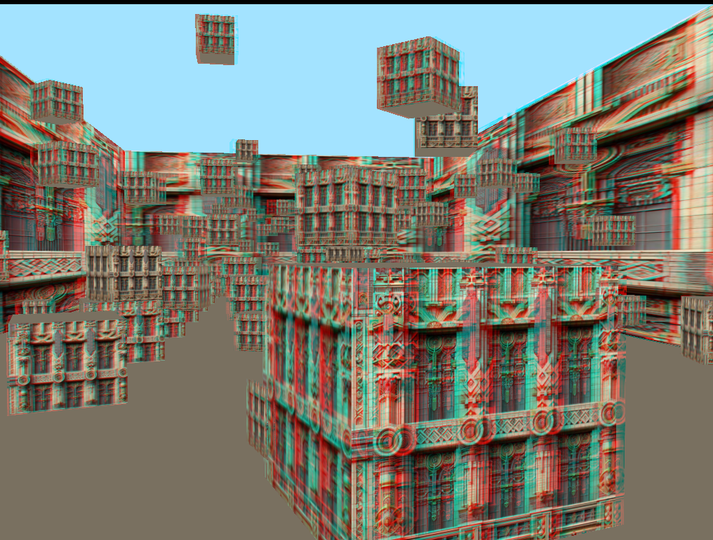
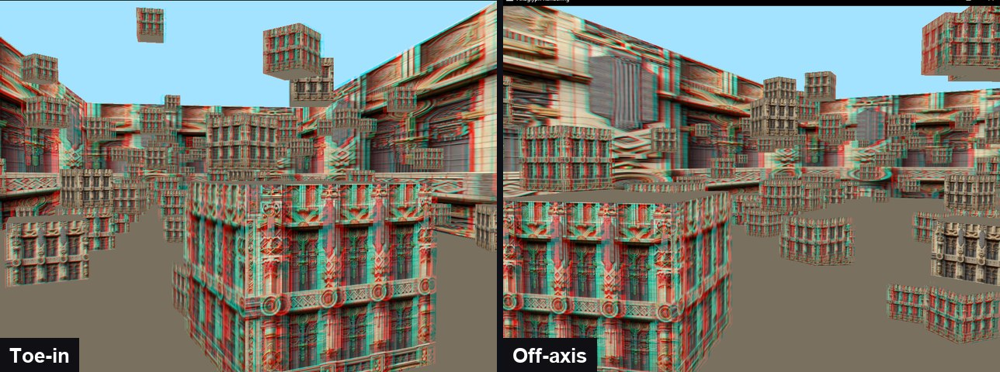

# Anaglyph Stereo Rendering

> Two ways to place a pair of virtual eyes, rendered as red-cyan 3D in C++/OpenGL

**Demo:** [demo.mp4](demo.mp4) (3 min, narrated)

## What was asked
Starting from a provided OpenGL template that renders a textured cube, implement (1) the **toe-in** stereo method, (2) the **asymmetric (off-axis) view frustum** method, (3) **two-pass rendering** to produce the anaglyph, and (4) a scene of your own to show depth.

## What I built
- **Toe-in:** each eye is offset along the camera's right vector and both look at the origin.
- **Off-axis:** the eyes stay parallel and each eye's `glm::frustum` is shifted by `(ipd / 2) * near / convergence`, with convergence set to the orbit radius (100), so the origin sits exactly on the screen plane.
- **Two-pass anaglyph:** the left eye renders into the red channel and the right eye into green and blue, with depth cleared between passes.
- **Live controls:** `M` switches toe-in and off-axis, `,` and `.` change eye separation (tested from 0 to 14.4), `P` swaps between my scene and the template's cubes, and the mouse orbits the camera with a clamp at the poles. One spherical-coordinate camera state drives every input.
- **Depth scene (part 4):** 100 boxes: a corridor, a near cube in front of the zero-parallax plane, 14 alternating depth markers and 81 randomly scattered cubes.

## Results

- Off-axis keeps vertical disparity at zero; toe-in shows the expected keystone effect (up to 3 px of vertical disparity in my screenshots), visible when the two modes are compared side by side in the video.

## Files
- `anaglyph.cpp`: my implementation (it builds against the module's OpenGL template, which is not included).
- `screenshots/`: anaglyph renders. `demo.mp4`: narrated walkthrough of the controls and the comparison.

## Notes
- I used GitHub Copilot Chat while working on this lab; the final colour-clear order is my correction of its suggestion.
